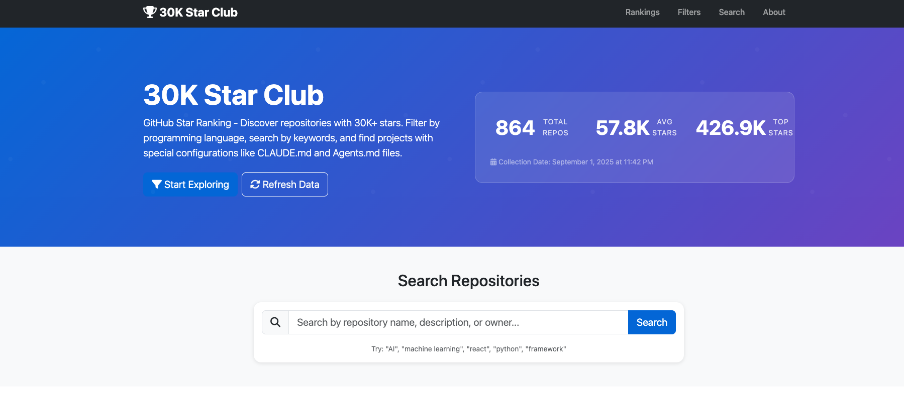
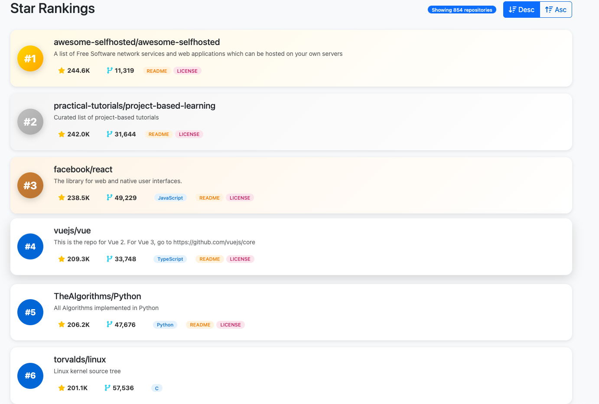

# Awesome Repo 30K Star Club Ranking



A curated ranking and analysis platform for GitHub repositories with over 30,000 stars, featuring advanced filtering to discover projects with CLAUDE.md and Agents.md files that showcase AI-powered development practices.

## 🎯 Live Demo

**🔗 Live Application**: [https://bobdla.github.io/awesome_repo_30k_star_club/frontend/index.html](https://bobdla.github.io/awesome_repo_30k_star_club/frontend/index.html)

**📅 Data Collection Date**: September 1, 2025

## ✨ Key Features

### 🤖 AI Development Pattern Detection

#### CLAUDE.md Filtering
- **Specialized filtering** for repositories containing `CLAUDE.md` files
- **Discover AI-configured projects** using Claude AI for development
- **One-click access** to all Claude-powered development workflows
- **Real-time statistics** showing adoption trends

#### Agents.md Filtering
- **Agent-based development** detection through `Agents.md` files
- **Find AI agent configurations** and autonomous systems
- **Discover cutting-edge** AI-driven development practices
- **Identify multi-agent** development environments

### 🔍 Advanced Multi-dimensional Filtering

#### Language Filtering
- **Comprehensive language support**: Python, JavaScript, TypeScript, Java, Go, Rust, C++, Ruby, PHP, Swift, Kotlin, C#, Shell, HTML, CSS
- **Real-time language statistics** and distribution analysis
- **Combined filtering** with other criteria

#### Star Count Analysis
- **Customizable star ranges** with min/max configuration
- **Focus on high-quality repositories** (default: >30,000 stars)
- **Star-based ranking** and trending analysis

#### Special File Detection
- **Comprehensive file pattern recognition**:
  - `README.md` - Project documentation
  - `LICENSE` - Open source licensing
  - `CONTRIBUTING.md` - Development guidelines
  - `CLAUDE.md` - Claude AI configuration ⭐
  - `Agents.md` - AI agent configurations ⭐

### 📊 Real-time Analytics Dashboard



#### Live Statistics
- **Total repository count** with real-time updates
- **CLAUDE.md adoption rate** tracking
- **Agents.md implementation statistics**
- **Filter result counts** with instant feedback

#### Visual Analytics
- **Interactive charts** and data visualization
- **Trend analysis** for AI development patterns
- **Comparative statistics** across different criteria

## 🏗️ Technical Architecture

### JAMstack Implementation
- **J**avaScript - Dynamic interaction and real-time filtering
- **A**PIs - GitHub API integration and data processing
- **M**arkup - Static HTML generation for optimal performance

### Deployment Options
#### 1. Pure Static Deployment
- **Zero configuration** - Upload `index.html` directly
- **CDN-ready** - Compatible with any static hosting service
- **Instant deployment** - No build process required

#### 2. GitHub Pages Jekyll
- **Enhanced features** with Jekyll processing
- **Automated deployment** through GitHub Actions
- **Custom domains** and HTTPS support

### Responsive Design
- **Mobile-first** responsive design using Bootstrap 5
- **Cross-browser compatibility** (Chrome 60+, Firefox 55+, Safari 12+, Edge 79+)
- **Accessibility** compliant with WCAG 2.1 guidelines

## 📁 Project Structure

```
github-agent-frontend/
├── frontend/
│   ├── index.html              # Main application (pure HTML)
│   ├── index.md               # Jekyll version
│   ├── _config.yml            # Jekyll configuration
│   ├── _layouts/
│   │   └── default.html       # Layout template
│   ├── css/
│   │   └── style.css          # Custom styling
│   ├── js/
│   │   └── app.js             # Core application logic
│   └── data/
│       ├── sample_data.json   # Demo dataset (864 repositories)
│       └── repositories.json  # Repository metadata
├── pic/                       # Application screenshots
└── README.md                  # This file
```


## 📈 Current Dataset Statistics

- **Total Repositories**: 864 high-star GitHub repositories (>30,000 stars)
- **CLAUDE.md Projects**: 37 repositories with Claude AI configurations
- **Agents.md Projects**: 12 repositories with AI agent configurations
- **Languages Covered**: 16+ programming languages
- **Data Freshness**: Real-time GitHub API integration


## 🎨 CLAUDE.md & Agents.md Significance

### What is CLAUDE.md?
`CLAUDE.md` files contain **AI development instructions** for Claude AI assistant, including:
- **Development guidelines** and coding standards
- **Project-specific commands** and workflows
- **Architecture decisions** and design patterns
- **Testing strategies** and quality requirements

### What is Agents.md?
`Agents.md` files define **AI agent configurations** for autonomous development:
- **Multi-agent coordination** protocols
- **Task automation** workflows
- **Agent communication** patterns
- **Autonomous development** processes

### Why These Files Matter
- **AI Adoption Indicator**: Presence shows advanced AI integration
- **Development Efficiency**: AI-powered workflows accelerate development
- **Quality Standards**: AI configurations enforce consistent practices
- **Future-Proofing**: AI-ready projects are more maintainable

## 🌟 Use Cases

### For Developers
- **Discover AI-powered projects** for learning and inspiration
- **Find development best practices** from AI-configured repositories
- **Identify trending technologies** in high-star repositories
- **Explore new programming paradigms** and architectures

### For Researchers
- **Study AI adoption patterns** in open-source development
- **Analyze development workflow evolution** over time
- **Identify emerging trends** in AI-assisted programming
- **Track technology adoption** across different domains

### For Organizations
- **Benchmark AI development practices** against industry leaders
- **Identify technology trends** for strategic planning
- **Discover best practices** for AI integration
- **Find open-source solutions** for specific requirements


## 🤝 Contributing

We welcome contributions to improve this project! Please feel free to:
- **Report Issues**: [GitHub Issues](https://github.com/your-repo/issues)
- **Submit Pull Requests**: [GitHub PRs](https://github.com/your-repo/pulls)
- **Suggest Features**: [GitHub Discussions](https://github.com/your-repo/discussions)

## 📄 License

This project is licensed under the **MIT License** - see the [LICENSE](LICENSE) file for details.

## 🙏 Acknowledgments

- **GitHub API** for providing repository data
- **Bootstrap 5** for the responsive UI framework
- **Font Awesome** for iconography
- **Claude AI** for development assistance and inspiration

---

**🔗 Live Application**: [https://bobdla.github.io/awesome_repo_30k_star_club/frontend/index.html](https://bobdla.github.io/awesome_repo_30k_star_club/frontend/index.html)

**📅 Last Updated**: September 1, 2025

Made with ❤️ for the AI development community